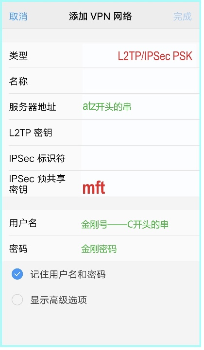

## 美国金刚公司出品一一

## 《L2型金刚号在安卓手机、安卓平板、安卓机顶盒上的配置说明》
### 一、L2型的特点

1. 优势：勿需下载、安装客户端软件。省去了与客户端软件相关的琐事。
2. 优势：适用面宽。可用于安卓手机、苹果系列设备、Windows等多种设备。
3. 优势：“一拖九”。一个金刚号可配入9部设备，并可同时连通，共享号内流量。
4. 优势：操作简单，极易上手。在您的手机等设备上配置几条参数即可使用。
4. 不足：连接易中断，中断后需要手动重连。在信号较弱、信号源切换、手机黑屏时，连接将中断。

### 二、适用设备
适用于 安卓手机、安卓平板、安卓机顶盒 环境

### 三、所需工具
- 安卓手机 或安卓平板 或 安卓机顶盒
- 金刚号（非c9开头）及配套参数

### 四、金刚号的获取、送达、配置
#### a、获取

- 如果您已持有金刚号（非c9开头），则请忽略此条 
- 如果您尚无金刚号（非c9开头），则在[ 金刚网 > 商店 ](https://www.atozitpro.net/zh/shop/) 里选购L2型金刚号（点击该链接前，请务必先翻墙出来，因为金刚网永久被墙）。 

其中包含： 
- 金刚号 
- 金刚密码 
- 服务器 
- 密钥 

#### b、送达

如果您已持有金刚号（非c9开头），则请忽略此条 
如果您尚无金刚号（非c9开头），则请阅读以下内容 

商品将分两路送达：
- 第一路送达 [金刚网 菜单 > 我的金刚](https://www.atozitpro.net/zh/my-account/) 下，请您在此取货（点击该链接前，请务必先翻墙出来，因为金刚网永久被墙）。
- 第二路以《金刚派号单》的形式送达您的邮箱，请在您的邮箱取货。

#### c、配置
 
1、点开手机主屏上的 设置, 在 设置 下，设法找到VPN 
2、因采用安卓的手机厂商为数众多，设置 下的条目五花八门，因此，金刚无法用统一的名词、术语做精准描述。现仅以 ViVO 手机为主叙述 
3、常见的是在 设置 下有 更多设置 或 更多网络设置 或 虚拟网络设置 或 其他无线连接 等条目。其下又有 VPN 或 VPN设置 
4、点开 VPN 或 VPN设置 条目，此时，某些品牌的手机会强制机主录入开机密码 
5、在 VPN屏 下方，点 添加VPN配置… 或 添加VPN网络 或 + 号，弹出 添加VPN网络屏 
6、在 添加VPN网络屏 内点 类型 所在的行 
7、在 类型 的 6 个选项中：选 L2…/IPSec PSK  
8、在 名称 处填入： AAA金刚  
9、在 服务器 或 服务器地址  处填入： atz开头的串  
10、在 L2…密钥 处： 保持空白  
11、在 IPSec标识符 处： 保持空白  
12、在 IPSec预共享密钥 处填入： mft  
13、在 用户名 处填入： 金刚号  
14、在 密码 处填入： 金刚密码  
15、应勾选 记住用户名和密码 （有的安卓手机该项叫 保存用户信息 ） 
16、点屏幕右上角的 完成 ，退出 添加VPN网络屏 或 添加配置屏，到达 VPN屏 
17、当 完成 为灰色、不可点击时，点屏幕左上角的 取消 ，从 AAA金刚填空屏，到达 VPN屏 
18、在 VPN屏，如果手机上已经安装了多个VPN工具，则应确保 蓝色的勾 打在AAA金刚 一行的左侧，而不可打在其他VPN工具上 
19、在 VPN屏，打开 VPN 开关，开始连接金刚 
20、如果屏幕顶端出现  带框VPN 图标 或 钥匙 图标，则表示 金刚连接成功，即可自由上网。 
21、下载谷歌浏览器 Chrome 和 YouTube 视频播放器 
22、在金刚保持连接的状态下，在谷歌浏览器内录入网址 google.com，然后搜索您感兴趣的任何内容，或在 YouTube 视频播放器里搜索您感兴趣的任何内容 
23、如果连接失败，则请阅读[ 金刚网 > 菜单 > 帮助 > 金刚L2型 >《金刚L2型报错信息与原因》](https://www.atozitpro.net/zh/%e9%87%91%e5%88%9al2%e5%9e%8b%e6%8a%a5%e9%94%99%e4%bf%a1%e6%81%af%e4%b8%8e%e5%8e%9f%e5%9b%a0/)（点击该链接前，请务必先翻墙出来，因为金刚网永久被墙） 
24、安卓机顶盒的配置请参考以上步骤自主探索
### 五、连接

### 六、日常使用

#### 1、连通您的金刚号

#### 2、切断您的金刚号

#### 推荐阅读
- [ 金刚帮助 ](https://a2zitpro.github.io/web/列表-问题与解答)

