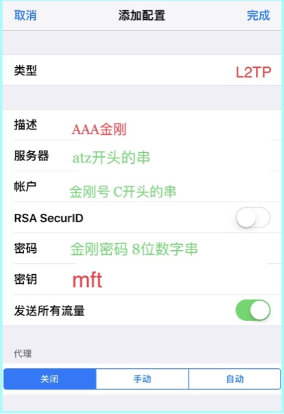

### 美国金刚公司出品一一
## 翻墙神器金刚梯
#### 金刚1.0 金刚号梯
#### 适用于 苹果手机iPhone

#### 特色
  - [ 一拖九 ](https://a2zitpro.github.io/web/一拖九)：一号在手，全家自由
  - [ 万能号 ](https://a2zitpro.github.io/web/万能金刚号)：一号万能，多机通用
 
#### 配置说明

- 点开手机主屏上的 设置 > 通用 > VPN > 添加VPN配置… 弹出上图 
- 在 类型 的 IKEv2、IPsec、L2TP 三个选项中：选 L2TP  
- 在 描述 处填入： AAA金刚  
- 在 服务器 处填入： atz 开头的串  
- 在 账户 处填入： 金刚号  
- RSASecurID 开关：关闭 
- 在 密码 处填入： 金刚密码  
- 在 密钥 处填入： mft  
- 发送所有流量 开关：打开 
- 在 代理 的 关闭、手动、自动 三个选项中：选 关闭 
- 点击右上角的 完成 
- 如果已安装多个 VPN 工具，则应勾选刚刚创建的 AAA金刚 ，确保 蓝色的勾 打在 AAA金刚 的左侧，不可打在其他VPN工具上 
- 状态开关：打开，开始连接金刚 
- 屏幕顶端出现 带框VPN 图标，表示 金刚连接成功，可自由上网 
- 下载谷歌浏览器 Chrome 和 YouTube 视频播放器 
- 在金刚保持连接的状态下，在谷歌浏览器内录入网址 google.com，然后搜索您感兴趣的任何内容，或在 YouTube 视频播放器里搜索您感兴趣的任何内容 
- 如果连接失败，则请参阅[ 《金刚L2型报错信息、原因及处置》](https://github.com/a2zitpro/web/blob/master/errormessageofL2.md)

    

#### 推荐阅读
- [金刚梯](https://a2zitpro.github.io/web/dlb)
