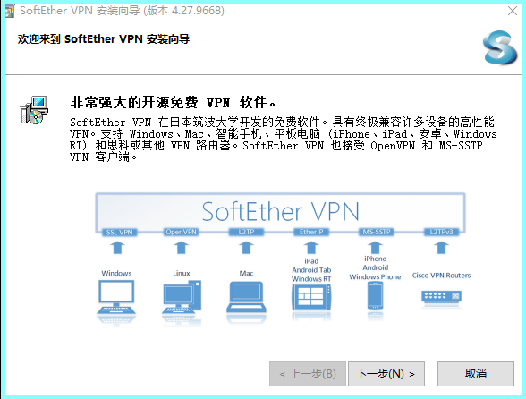
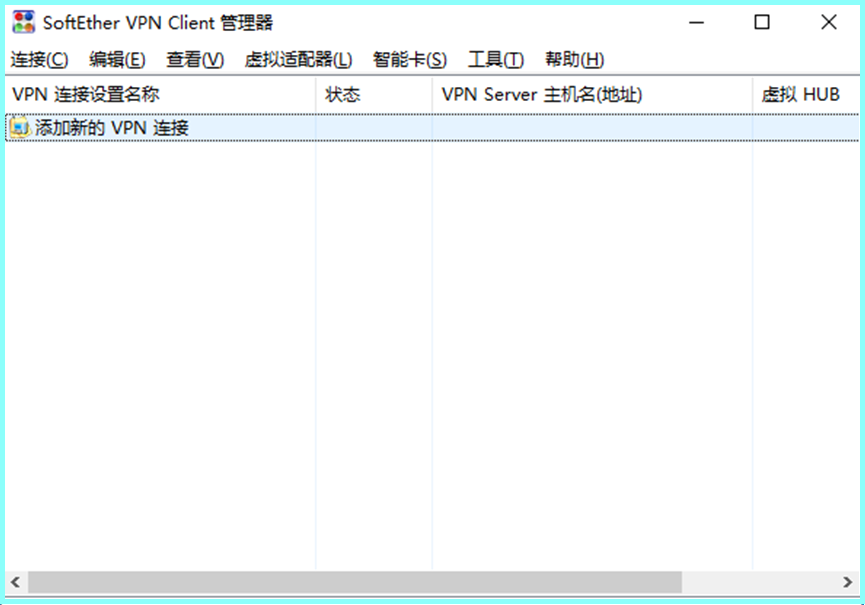
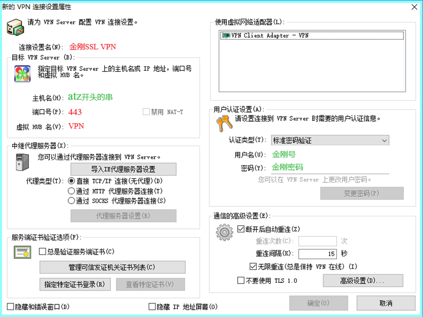
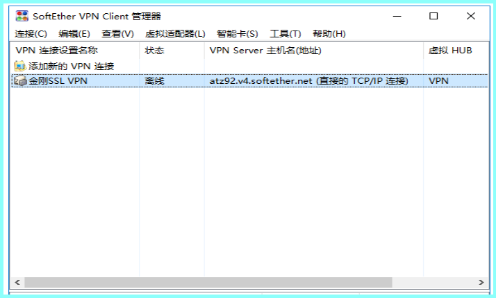
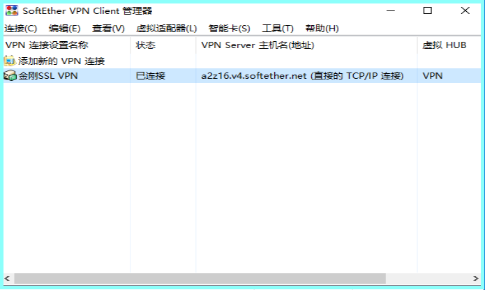

### 美国金刚公司＆筑波大学出品一一
## 翻墙神器金刚梯
#### 金刚2.0 App梯
#### 适用于 Windows+PC

#### 版权声明 
- app系筑波大学作品
- 金刚号及后台支撑由金刚公司提供

#### 特色
  - 一键翻墙
  - 安全高速 
  - 多条线路 
  - 免费公测 
  - HTTPS/SSL VPN

#### 获取
  - 

#### 推荐阅读
- [翻墙神器金刚梯](https://a2zitpro.github.io/web/dlb)

## 美国金刚公司＆筑波大学出品一一

## 金刚2.0 for Windows 配置说明

### 版权声明 
- app系筑波大学作品
- 后台支撑由金刚公司提供

### 一、特点
- 速度更快——比L2型速度更快
- 自动重连——在连接中断时自动重连
- 更加健壮——比L2型更加健壮，生命力更强

### 二、适用设备
适用于 PC+Windows 环境

### 三、所需工具
- 客户端
- 金刚号

### 四、客户端 的 下载、安装
#### 1、下载
app安装包请在此 [点击下载](https://github.com/SoftEtherVPN/SoftEtherVPN_Stable/releases/download/v4.28-9669-beta/softether-vpnclient-v4.28-9669-beta-2018.09.11-windows-x86_x64-intel.exe) 。
#### 2、安装
在下载文件夹内，点击安装包，开始安装。

每遇类似如上画面，点击下一步，直到完成安装。

安装完成后，将在PC桌面上生成如下图标：

### 五、金刚号 的 获取、送达、配置
#### a、获取

- 如果您已持有c9开头金刚号，则请忽略此条 
- 如果您尚无c9开头金刚号，则在[ 金刚网 > 商店 ](https://www.atozitpro.net/zh/shop/) 里选购SSL型c9开头金刚号（点击该链接前，请务必先翻墙出来，因为金刚网永久被墙）。 

请在[ 金刚网 > 商店 ](https://www.atozitpro.net/zh/shop/)里选购SSL型免费金刚号： 

- [KKSSL-FREE—当下免费金刚号](https://www.atozitpro.net/zh/product/kkfree-ssl)

（点击该链接前，请务必先翻墙出来，因为金刚网永久被墙）。 

其中包含 金刚号 和 金刚密码。

#### b、送达

- 如果您已持有c9开头金刚号，则请忽略此条 

- 如果您尚无c9开头金刚号，则请阅读以下内容 

商品将分两路送达：
- 第一路送达 [金刚网站 菜单 > 我的金刚](https://www.atozitpro.net/zh/my-account/) 下，请您在此取货。（点击该链接前，请务必先翻墙出来，因为金刚网永久被墙）。 
- 第二路以《金刚派号单》的形式送达 您的邮箱，请在您的邮箱取货。

#### c、配置

点击桌面图标：

弹出如下窗口：

双击 添加新的VPN连接
或
在窗口右击，选 新VPN连接设置，弹出如下窗口：

在该窗口中按照以下规则填写：
- 红色内容：按照上图内容原样填入
- 绿色内容：按照购买的内容填入
- 其余内容：保持原状

点击 确定，完成配置，窗口关闭，弹出如下窗口。

### 六、连接

双击 金刚SSL VPN

或 右击，选 连接

则 金刚SSL开始尝试连通。

当 状态 从 离线 改变为 已连接 时，说明 金刚SSL连接成功，可自由上网。

### 七、日常使用

#### 1、连通 金刚SSL VPN

点击桌面图标：

弹出如下窗口：

双击 金刚SSL VPN

或 右击，选 连接

则 金刚SSL 开始尝试连通。

当 状态 从 离线 改变为 已连接 时，说明 金刚SSL 连接成功，可自由上网。

#### 2、切断 金刚SSL

右击下图中的 金刚SSL VPN

在下拉菜单中选 断开，则切断连接

#### 推荐阅读
- [翻墙神器金刚梯](https://a2zitpro.github.io/web/dlb)
- [关于金刚VPN产品等](https://a2zitpro.github.io/web/列表-关于金刚VPN产品等)
- [问题与解答](https://a2zitpro.github.io/web/列表-问题与解答)
